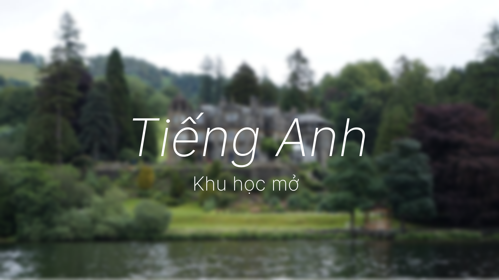

# Hướng dẫn bắt đầu tự học Tiếng Anh
Chào mừng đã đến với trang học Tiếng Anh này. Đây là trang sẽ hướng dẫn bạn cách tự học Tiếng Anh *chuẩn*.

### Trước khi bắt đầu học
Bạn sẽ học Tiếng Anh thông qua Comprehensible Input và Immersion. Toàn bộ các nội dung liên quan đến phương pháp và hướng dẫn học bạn có thể đọc trên trang [Tự luyện ngoại ngữ](https://daihocmo.github.io/ngoai-ngu/).

Trang hướng dẫn Tiếng Anh này sẽ tập trung nhiều hơn vào các nội dung khác như **Hướng dẫn tự học Tiếng Anh**, **Chương trình Tiếng Anh 30 ngày** hay **Tổng hợp tài nguyên tự học Tiếng Anh**. Đồng thời, giải đáp những thắc mắc mọi người thường gặp khi học Tiếng Anh.

### Hướng dẫn bắt đầu

Sau khi bạn đọc qua trang [Tự luyện ngoại ngữ](https://daihocmo.github.io/ngoai-ngu/) và nắm được tương đối phương pháp tự học, bạn bây giờ có thể đọc bất kì trang nào bạn muốn đọc trong trang Tiếng Anh này vì mình không viết theo một thứ tự nào cả. Cá nhân mình gợi ý đọc [Lộ trình tự học](guide.md) và [Tiếng Anh 30 ngày](30ngay.md) trước rồi sau đó chuyển qua trang [Tài nguyên tự học](resources.md) và bắt đầu tự học theo nhu cầu của bạn.

### Lời cảm ơn

**Trang này được phát triển dựa trên trang TheMoeWay và Donkuri**: Rất nhiều ý tưởng và cả bản dịch và hiệu đính lại của mình cũng là từ [những bài viết trên TMW](https://learnjapanese.moe/). 

Nếu có thể, bạn hãy ghé trang TMW để đọc thêm về phương pháp học Tiếng Nhật của họ, hoặc thậm chí donate cho tác giả của những bài viết đó trên Patreon là shoui. 

Mình cũng đã tham khảo cấu trúc trang của Donkuri nữa (Cảm ơn shoui và donkuri rất nhiều vì những hướng dẫn học tập của mọi người :>).