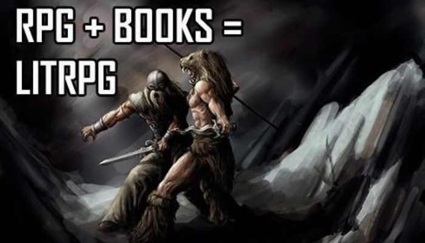

# LitRPG

### Giới thiệu sơ lược

LitRPG (literary role-playing game) hay dịch nôm na là "Fantasy Kết Hợp Game", có thể hiểu như cái tên gọi của nó, là sự kết hợp của Fantasy (Một thể loại văn học) và Game. Trong kiểu tác phẩm này, nhân vật chính thường sống trong một thế giới giống game, với hệ thống cấp độ, kỹ năng, và nhiệm vụ.

Ví dụ như Solo Leveling của Chugong, Ready Player One của Ernest Cline. Thể loại này mang lại cảm giác "thăng cấp" và khám phá thế giới mới khiến độc giả như trở thành một phần của câu chuyện.

Nguồn gốc của thể loại thì đã có từ những năm 1970, với cuốn *Quag Keep* của Andre Norton. Trong đó, các nhân vật từ thế giới thật bị cuốn vào thế giới Dungeons & Dragons, nơi xúc xắc định đoạt mọi sự kiện họ gặp. Tác phẩm này được xem như tổ tiên xa xưa của nhánh LitRPG phổ biến ngày nay – kiểu “dị giới” (portal fantasy hay *isekai*), nơi nhân vật bị đưa sang một thế giới khác, nơi được vận hành như kiểu trong trò chơi.

### Bắt đầu thế nào?

Bạn có thể đọc [Wiki của r/LitRPG](https://old.reddit.com/r/litrpg/wiki/index), cũng như [r/Fantasy](https://old.reddit.com/r/Fantasy/).
