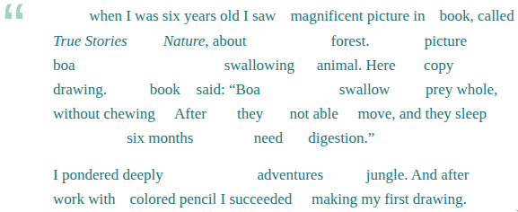

# Khai thác tối đa các văn bản Tiếng Anh

## Đọc để lấy nội dung

Thông thường, khi đọc một văn bản, mọi người thường “đọc để tìm nội dung”. Mục tiêu của chiến lược này là nắm được ý chính của văn bản càng nhanh càng tốt và tốn ít công sức nhất có thể. Để hoàn thành mục tiêu này, não của bạn sẽ cố gắng đọc càng ít từ càng tốt và chỉ dành một phần giây cho mỗi từ.

Ví dụ, khi đọc đoạn văn sau, bạn không thực sự thấy nó như thế này:

> Once when I was six years old I saw a magnificent picture in a book, called _True Stories_
> _from Nature_, about the primeval forest. It was a picture of a boa constrictor in
> the act of swallowing an animal. Here is a copy of the drawing.
> In the book it said: “Boa constrictors swallow their prey whole, without chewing
> it. After that they are not able to move, and they sleep through the six months
> that they need for digestion.”
>
> I pondered deeply, then, over the adventures of the jungle. And after some work
> with a colored pencil I succeeded in making my first drawing.

Đối với bộ não của bạn, nó trông ít nhiều giống thế này:

Việc “đọc để tìm nội dung” có một số đặc điểm như sau:

Bỏ qua “từ ngữ pháp” như A, THE, IN, OF, THROUGH, THAT.. chỉ có từ chứa nội dung(danh từ chính, động từ, tính từ và trạng từ).

Không nhìn thấy dạng từ: Có phải LOOK hay là LOOKED? HAS LOOKED hoặc HAD LOOKED?

Không để ý chính tả chính xác. Người ta biết rõ rằng bộ não nhận biết toàn bộ các từ - nó không phân tích chúng từng chữ một. Người bản ngữ nhìn thấy từ PIECE mọi lúc, nhưng nhiều người trong số họ vẫn viết sai chính tả là PEICE, vì hai cách viết có hình dạng tương tự nhau.

Bỏ qua những từ khó không cần thiết để hiểu nghĩa (here: PRIMEVAL, CONSTRICTOR)). Liệu có thời gian để sử dụng từ điển?

Một ví dụ cực đoan về “sự bỏ qua này” là câu đố khá nổi tiếng, trong đó bạn được yêu cầu đếm xem chữ cái đó bao nhiêu lần F xuất hiện trong đoạn văn sau:

> FINISHED FILES ARE THE RESULT OF YEARS OF SCIENTIFIC STUDY COMBINED WITH THE EXPERIENCE OF YEARS.

Đọc để lấy nội dung là một cách tuyệt vời, tiết kiệm thời gian để lấy thông tin từ văn bản. Vấn đề là bạn có thể không cần các từ ngữ pháp để hiểu một văn bản, nhưng bạn cần chúng để tạo ra một văn bản. nếu bạn bỏ qua ngữ pháp trong khi đọc, bạn có thể gặp khó khăn khi sử dụng chúng một cách chính xác trong câu của mình.

Ví dụ, đây là một câu trong đoạn mở đầu của bài viết này. Hầu hết người học (trừ những người thành thạo ngữ pháp tiếng Anh hoặc cực kỳ để ý) có lẽ sẽ gặp khó khăn khi điền vào chỗ trống:

> To accomplish this goal, your brain will try to read as \_\_\_ words as possible and spend only a fraction of \_\_\_ second \_\_\_ each word.

Trên đây giải thích tại sao một số người học có thể đọc một cuốn sách 300 trang mà vẫn gặp vấn đề về ngữ pháp tương đối cơ bản. Nó cũng giải thích tại sao mạo từ và giới từ là một trong những phần khó học nhất của tiếng Anh. Kết luận dành cho người học tiếng Anh là nếu bạn muốn cải thiện kỹ năng output của mình,bạn có thể phải rèn luyện bản thân để chú ý đến các từ ngữ pháp.

Đây là một đoạn “khai sáng” về vấn đề trên của Maya l’abeille tại Diễn đàn Antimoon:
Tôi tin rằng việc nhìn thấy những câu tiếng Anh đúng và điển hình sẽ giúp ích rất nhiều để sử dụng tiếng Anh đúng. Điều quan trọng là phải đọc đi đọc lại mọi cấu trúc mới đối với bạn để bạn có thể ghi nhớ chúng. Nếu chỉ đọc mà không dừng lại để suy nghĩ kỹ về những câu “mới”, khó để các câu “mới” đó còn đọng lại trong đầu bạn

Bản thân tôi đã đọc tất cả các cuốn sách Harry Potter và khi mở lại, tôi nhận ra rằng mình đã xem vô số cấu trúc hữu ích mà không nhớ chúng - thật đáng tiếc! Hiện tại tôi đang đọc The Full Monty (bộ sưu tập Penguin Readers) bằng phương pháp “tạm dừng và suy nghĩ”. Bây giờ sau vài ngày đọc, tôi xem một văn bản tiếng Anh, tôi thấy nhiều cấu trúc quen thuộc với tôi - “Này, tôi nhớ đã đọc cấu trúc này trong The Full Monty!”.

Vì vậy, tôi tin rằng phương pháp này hiệu quả và tôi sẽ giới thiệu nó cho tất cả người học.

Đôi khi, chúng ta không nhận ra rằng chỉ một cuốn sách có thể giàu có đến mức nào - chỉ cần học một trong số đó là có rất nhiều điều để học.

## Tạm dừng và suy nghĩ

Tôi đồng ý với Maya về phương pháp “tạm dừng và suy nghĩ”. Đây là quy trình tôi khuyên bạn nên xử lý các câu trong văn bản:

Dừng lại ở những điều thú vị (mà không rõ ràng cho lắm): một từ mới, cách sử dụng một từ, cấu trúc ngữ pháp, giới từ, mạo từ, liên từ, thứ tự các từ, v.v. Ví dụ: dành một chút thời gian để suy nghĩ về thực tế là câu có chứa giới từ AT chứ không phải ON. Câu đó có lẽ sử dụng thì hiện tại hoàn thành chứ không phải là thì quá khứ đơn như bạn nghĩ. Có lẽ trật tự từ khác với ngôn ngữ mẹ đẻ của bạn.

Nếu câu có chứa một cụm từ hữu ích, hãy tự hỏi: Bạn có thể tự mình tạo ra một cụm từ tương tự không? Bạn có sử dụng đúng thì, mạo từ và giới từ không? Liệu thứ tự từ sẽ đúng chứ? Nếu bạn không chắc chắn, hãy đọc lại cụm từ đó. Hãy tập nói nó (hoặc một cụm từ tương tự) thành tiếng hoặc trong đầu. Hãy biến nó thành một phần trong bộ não của bạn
Nếu cần thiết hoặc nếu bạn thích, hãy sử dụng từ điển để tìm nghĩa của từ trong câu và lấy thêm các câu ví dụ. Điều này sẽ củng cố “cảm giác” của bạn về từ đó.

Nếu bạn sử dụng SRS, hãy cân nhắc việc thêm cụm từ vào bộ thẻ của bạn (ví dụ: dưới dạng thẻ câu) để đảm bảo bạn sẽ nhớ nó thật lâu. Tất nhiên, chỉ nên thêm những cụm từ hữu ích.

## Ghi chú quan trọng

Bạn không cần phải lúc nào cũng phải “tạm dừng và suy nghĩ”. Đọc ở chế độ này có thể khá mệt mỏi, vì vậy đừng làm điều đó khi bạn cảm thấy mệt mỏi sau một buổi đọc dài.
Đừng cố gắng tập trung vào từng cụm từ.

Một số cụm từ không hữu ích. Một số nhân vật trong sách và phim sử dụng những cách diễn đạt rất sặc sỡ nhưng hiếm gặp (ví dụ: “This girl’s family has got you by the short ones”). Tiểu thuyết thường chứa ngôn ngữ văn học không hữu ích cho việc xây dựng câu văn của riêng bạn (ví dụ: “A matted depression across mustache and beard showed where a stillsuit tube had marked out its path from nose to catchpockets”).

Một số cụm từ quá khó đối với bạn. Cố gắng tập trung vào những thứ nằm trong tầm tay của bạn, tức là cao hơn một cấp so với trình độ hiện tại của bạn. Nếu bạn vẫn đang gặp khó khăn với thì hiện tại hoàn thành, đừng lãng phí sự chú ý của mình vào những câu như “I don’t know what it is that the officer said he had seen me do”. (Nếu bạn tiếp tục gặp các câu nâng cao, có lẽ bạn nên chuyển sang văn bản dễ đọc hơn)

Kỹ thuật “tạm dừng và suy nghĩ” không phải lúc nào cũng khiến bạn nhớ chính xác cách nói điều gì đó. Nhưng có lẽ bạn sẽ nhớ rằng loại câu mà bạn đã đọc đó khá có vấn đề khi sử dụng trong Tiếng Anh. Nếu nhớ được điều đó, ít nhất nó sẽ khiến bạn dừng lại trước khi viết câu đó và tra cứu thay vì mắc lỗi bất cẩn.

Bạn không cần phải nghĩ rằng Tại sao điều này lại được diễn đạt như vậy. Mục đích là tập trung sự chú ý của bạn chứ không phải là nghĩ ra các quy tắc ngữ pháp. (Tuy nhiên, nếu bạn muốn nghĩ về các quy tắc ngữ pháp, bạn có thể làm được)

Nếu bạn không muốn ngừng đọc (để tra một từ trong từ điển hoặc thêm một cụm từ vào SRS), bạn có thể viết ra tất cả các câu thú vị hoặc bạn có thể gạch chân chúng trong sách bằng bút chì. Bằng cách này, bạn có thể xử lý những câu này sau.

## Một ví dụ

Bây giờ tôi sẽ trình bày ngắn gọn về phương pháp “tạm dừng và suy nghĩ”. Dưới đây là hai câu tiếng Anh và ví dụ về những suy nghĩ mà bạn sẽ có được khi đọc chúng:

> Former President Jimmy Carter will visit Venezuela next week to mediate talks
> between the government and its opposition, which have been locked in a
> power struggle since a failed coup.

- “Former President” — chứ không phải là “The former President”, nên tôi nghĩ là mình nên dùng “President Carter” chứ không phải là “The President Carter”, kể cả khi ta nói “The President will do something” khi chúng ta không đề cập đến tên của người đó

- “to mediate talks” — không phải là “to mediate in the talks” hoặc đại loại vậy. Tôi tự hỏi không biết nó có ổn không

- “power struggle” — Có lẽ mình đã từng gặp mẫu câu này.

- “since a failed coup” — và mình có thể nói “He’s been paralyzed since an accident” (sử dụng trợ động từ) chứ không nhất thiết phải nói “He’s been paralyzed since an accident happened” (sử dụng liên từ?).

- “since a failed coup” — chứ không phải “since the failed coup”. tác giả cho rằng người đọc chưa biết về cái “coup” ở trong bài (vậy nên mới dùng mạo từ “a”)

- “coup” — cái này phát âm là /ku:/!

> Jennifer McCoy, of the Atlanta-based Carter Center, told reporters Saturday that Carter may be able to help break the political deadlock when he visits beginning July 6.

- “Jennifer McCoy of the Carter Center” — chứ không phải “Jennifer McCoy from the Carter Center”. liệu dùng FROM sẽ bị sai

- “Atlanta-based” — một cách khác để nói “based in Atlanta”. Có thể thử “Wroclaw-based webmaster”.

- “told reporters Saturday” chứ không phải “on Saturday” — có lẽ đôi lúc có thể bỏ qua “on”. “I met her Friday” cũng tương tự“I met her on Friday”.

- “told that Carter may be able” — chứ không phải “told that Carter might be able”. Có lẽ giáo viên của mình chưa đúng khi dạy mình “She said she might stay” thay vì “She said she may stay”.

- “to help break the deadlock” — Có lẽ có thể sử dụng HELP mà không cần tân ngữ (nó không nói là “to help Venezuelans break the deadlock”), và không có TO (nó không nói là “help to break the deadlock”). Khác với các động từ khác như FORCE (không thể nói“The President will force break the deadlock”, mà cần phải là “The President will force Venezuelans to break the deadlock.”).

- “when he visits” — không phải “when he will visit” mặc dù điều này xảy ra trong tương lai. Mình không nghĩ là mình đã từng thấy WILL được sử dụng trong một câu như vậy.

- “to visit beginning July 6” – Câu này hay đây! — Có lẽ mình đã dùng“to visit on July 6”, nhưng ở đây là BEGINNING thay vì ON. Lần đầu tiên mình thấy kiểu này. Có lẽ nó là một số cách dùng từ trong báo và tin tức?

!!! info "Nguồn bài viết"
    Là bản dịch của bài [How to get the most out of English texts - Antimoon](https://www.antimoon.com/how/readhow.htm)